# Learn Kubernetes

I created this repository as my hands-on Kubernetes learning notes. The goal is to understand Kubernetes step by step by writing YAML files, applying them on a local Minikube cluster, checking the output with `kubectl`, and also viewing the same resources from the Kubernetes Dashboard.

## What I Am Learning

- How to start and manage a local Kubernetes cluster with Minikube.
- How to use `kubectl` to inspect the cluster and its resources.
- How Pods, ReplicaSets, Deployments, Services, PersistentVolumes, PersistentVolumeClaims, and StatefulSets work.
- How Kubernetes keeps the desired state running.
- How to expose an application using a NodePort Service.
- How storage is attached to workloads using PV and PVC.
- How StatefulSets are different from Deployments.
- How to verify everything using command output and the Kubernetes Dashboard.

## Repository Structure

```text
Learn_Kubernetees/
|-- commands/
|   |-- img.png
|   |-- kubectl_commands.png
|   `-- minikube_commands.png
|-- config_files/
|   |-- my-deployment.yml
|   |-- my-pod.yml
|   |-- my-pv.yml
|   |-- my-pvc.yml
|   |-- my-replicaset.yml
|   |-- my-service.yml
|   `-- my-stateful-set.yml
`-- images/
    |-- img.png
    |-- img_1.png
    |-- img_2.png
    |-- img_3.png
    |-- img_4.png
    |-- img_5.png
    |-- img_6.png
    |-- img_7.png
    |-- img_8.png
    |-- Screenshot 2026-01-29 220751.png
    `-- Screenshot 2026-01-29 221545.png
```

## Prerequisites

Before using these files, I need these tools installed:

- Docker or another container runtime
- Minikube
- kubectl

Useful checks:

```bash
minikube version
kubectl version --client
```

## Minikube Commands

These are the Minikube commands I noted while learning how to start, stop, delete, and inspect my local cluster.

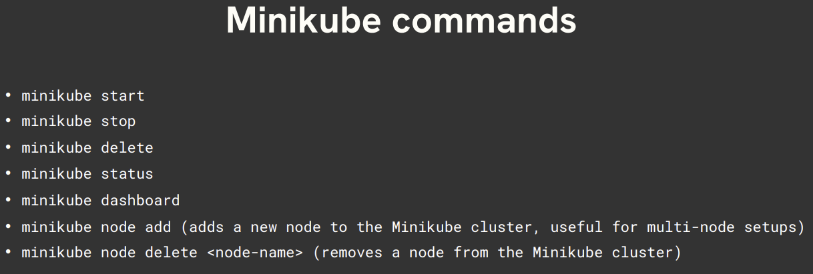

Common commands I use:

```bash
minikube start
minikube status
minikube dashboard
minikube stop
minikube delete
```

This screenshot shows Minikube being started and the cluster becoming ready.


## kubectl Commands

`kubectl` is the main command line tool I use to communicate with the Kubernetes cluster.

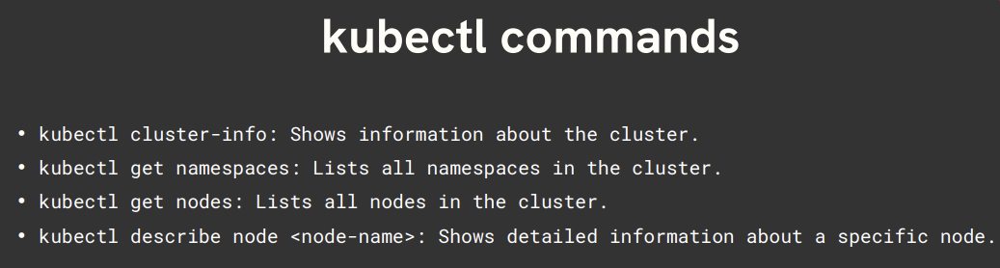

Some commands I use again and again:

```bash
kubectl get nodes
kubectl get namespaces
kubectl get pods
kubectl get services
kubectl get deployments
kubectl describe node <node-name>
```

This screenshot shows namespace information from the cluster.

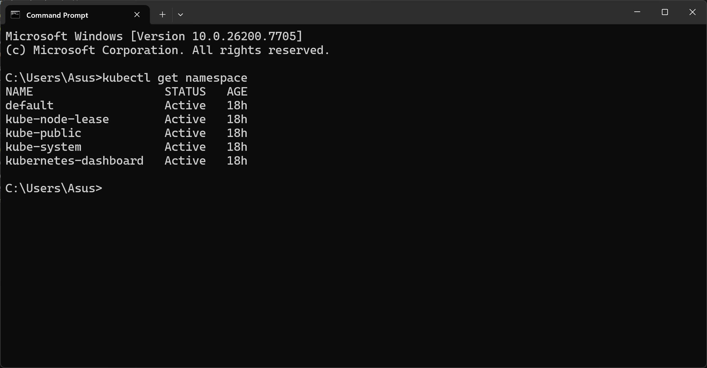

## Kubernetes Dashboard

I also used the Kubernetes Dashboard to visually confirm the resources created in the cluster.

```bash
minikube dashboard
```

Dashboard service view:

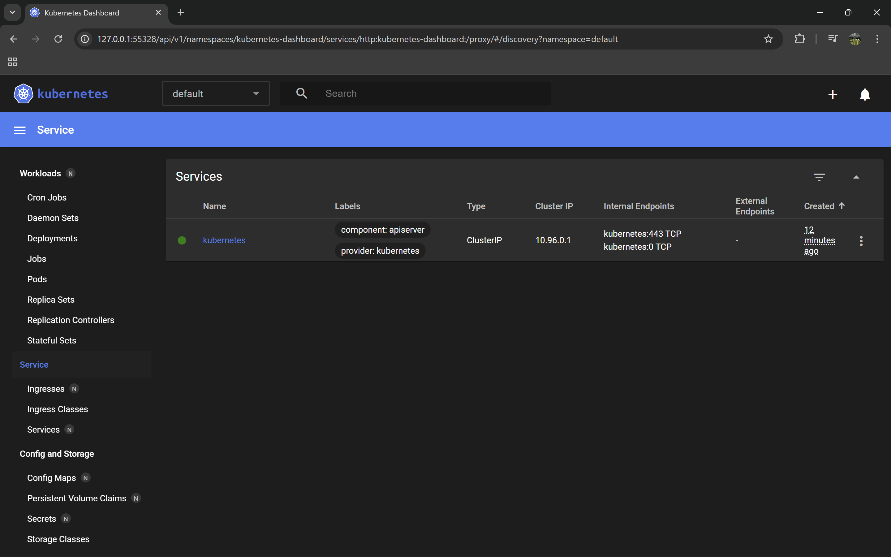

Dashboard deployments and pods view:

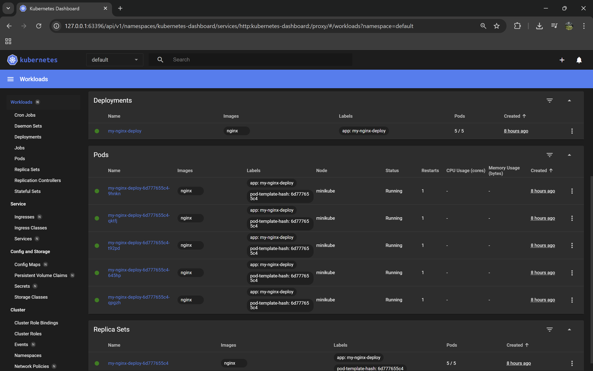

Dashboard workload page after cleanup:


## Pod

A Pod is the smallest deployable unit in Kubernetes. In this repo, I created an Nginx Pod using:

[config_files/my-pod.yml](config_files/my-pod.yml)

The Pod manifest creates:

- Pod name: `my-nginx-pod`
- Container name: `my-nginx-container`
- Image: `nginx`
- Container port: `80`
- Resource limit: `128Mi` memory and `500m` CPU

Apply it:

```bash
kubectl apply -f config_files/my-pod.yml
kubectl get pods
kubectl describe pod my-nginx-pod
```

This screenshot shows detailed `kubectl describe` output for a Kubernetes resource.

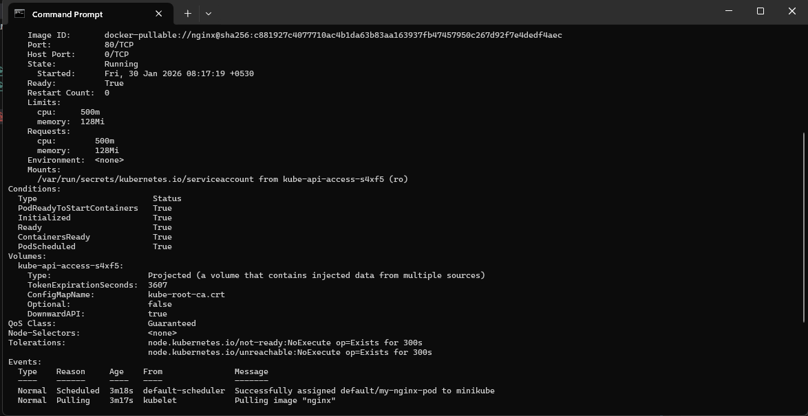

## ReplicaSet

A ReplicaSet makes sure a fixed number of Pod replicas are always running. In this repo, I created a ReplicaSet with 3 Nginx Pods:

[config_files/my-replicaset.yml](config_files/my-replicaset.yml)

Apply it:

```bash
kubectl apply -f config_files/my-replicaset.yml
kubectl get replicasets
kubectl get pods
```

The screenshot below shows the ReplicaSet and the Pods created from it.

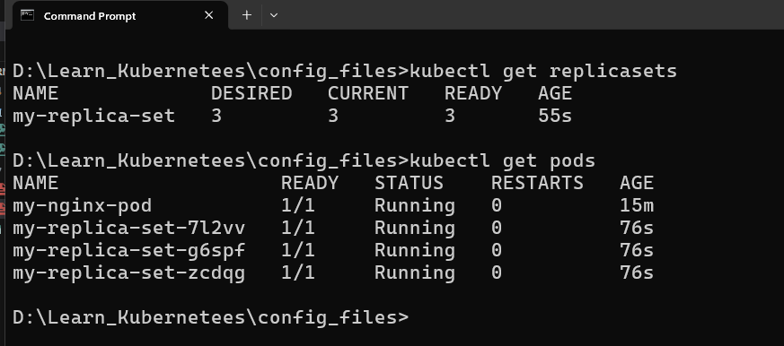

This screenshot shows Pod output after working with the ReplicaSet.

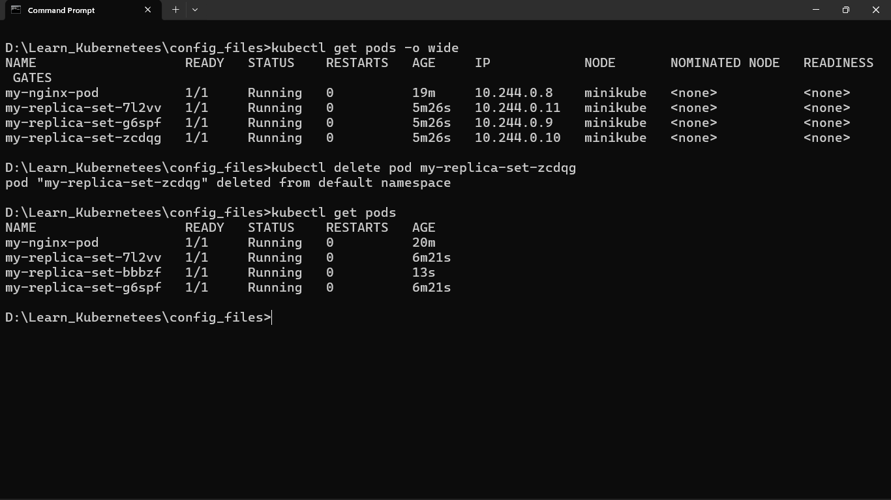

## Deployment

A Deployment is used to manage application rollout, scaling, and updates. It creates and manages ReplicaSets behind the scenes.

[config_files/my-deployment.yml](config_files/my-deployment.yml)

My Deployment creates:

- Deployment name: `myapp`
- Replicas: `3`
- Image: `nginx`
- Container port: `80`
- Volume mount: `/data`
- PVC used: `mypvc`

Apply it:

```bash
kubectl apply -f config_files/my-deployment.yml
kubectl get deployments
kubectl get pods
```

Deployment management commands:

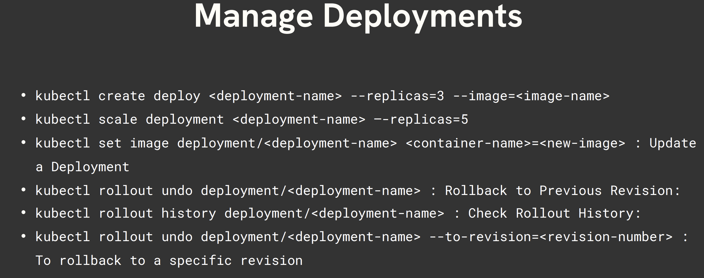

This screenshot shows the Deployment Pods and Deployment status.

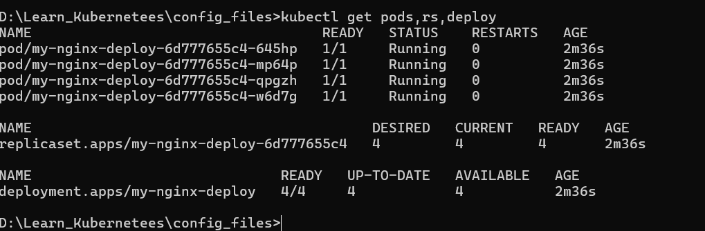

## Scaling a Deployment

One important feature of Kubernetes is scaling. I practiced scaling the Deployment up and down using `kubectl scale`.

Example:

```bash
kubectl scale deployment my-nginx-deploy --replicas=2
kubectl get pods --watch

kubectl scale deployment my-nginx-deploy --replicas=5
kubectl get pods --watch
```

This screenshot shows the Deployment being scaled and the Pods changing state.

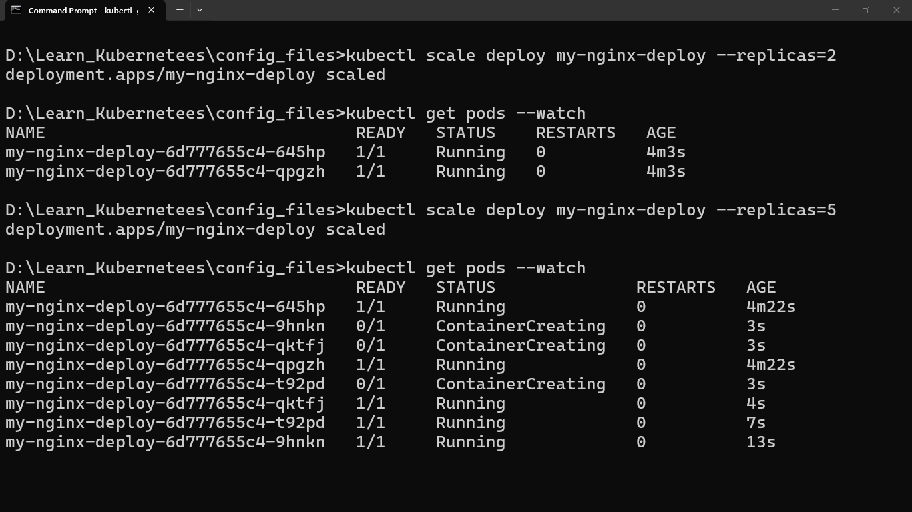

## Service

A Service gives a stable way to access Pods. In this repo, I created a NodePort Service:

[config_files/my-service.yml](config_files/my-service.yml)

Service details:

- Service name: `my-service`
- Type: `NodePort`
- Service port: `4000`
- Target container port: `80`
- NodePort: `30500`

Apply it:

```bash
kubectl apply -f config_files/my-service.yml
kubectl get services
```

In Minikube, I can open the service using:

```bash
minikube service my-service
```

## PersistentVolume and PersistentVolumeClaim

Kubernetes storage is handled separately from Pods. I practiced this using a PersistentVolume and a PersistentVolumeClaim.

PersistentVolume:

[config_files/my-pv.yml](config_files/my-pv.yml)

PersistentVolumeClaim:

[config_files/my-pvc.yml](config_files/my-pvc.yml)

The PV provides `1Gi` storage using a local `hostPath`:

```yaml
hostPath:
  path: /tmp/demo-pv
```

The PVC requests `1Gi` storage and binds to the PV named `mypv`.

Apply storage first:

```bash
kubectl apply -f config_files/my-pv.yml
kubectl apply -f config_files/my-pvc.yml
kubectl get pv
kubectl get pvc
```

Note: I am using `hostPath` because this is a local Minikube learning setup.

## StatefulSet

A StatefulSet is useful for applications that need stable identity, stable network names, and stable storage.

[config_files/my-stateful-set.yml](config_files/my-stateful-set.yml)

My StatefulSet creates:

- StatefulSet name: `mystatefulset`
- Replicas: `3`
- Image: `nginx`
- Headless Service: `headless-service`
- Volume claim template: `data`
- Storage request: `1Gi`

Apply it:

```bash
kubectl apply -f config_files/my-stateful-set.yml
kubectl get statefulsets
kubectl get pods
kubectl get pvc
```

## Cleaning Up Resources

For practice, I also deleted all resources and checked that nothing was left in the default namespace.

```bash
kubectl delete all --all
kubectl get pods
```

This screenshot shows resources being deleted and then no Pods found.

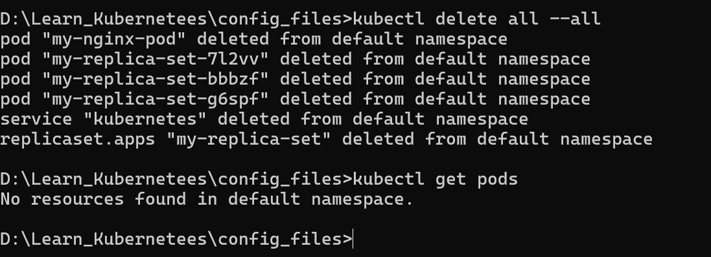

## My Learning Flow

This is the order I prefer while practicing:

1. Start Minikube.
2. Check cluster status with `kubectl`.
3. Apply the Pod manifest.
4. Apply the ReplicaSet manifest.
5. Apply the PV and PVC manifests.
6. Apply the Deployment manifest.
7. Apply the Service manifest.
8. Scale the Deployment.
9. Open the Kubernetes Dashboard.
10. Try the StatefulSet.
11. Delete resources and repeat.

Example full flow:

```bash
minikube start

kubectl apply -f config_files/my-pv.yml
kubectl apply -f config_files/my-pvc.yml
kubectl apply -f config_files/my-pod.yml
kubectl apply -f config_files/my-replicaset.yml
kubectl apply -f config_files/my-deployment.yml
kubectl apply -f config_files/my-service.yml
kubectl apply -f config_files/my-stateful-set.yml

kubectl get all
kubectl get pv
kubectl get pvc

minikube dashboard
```

## Important Notes

- Pods are the basic unit, but usually I should use Deployments instead of creating standalone Pods.
- ReplicaSets maintain the number of Pod replicas, but Deployments are better for real application management.
- Services provide stable access to Pods even when Pod IPs change.
- PV and PVC separate storage from application configuration.
- StatefulSets are different from Deployments because they keep stable Pod names and storage.
- Minikube is perfect for local learning, but production Kubernetes needs better storage, networking, security, and monitoring setup.

## Screenshots Collected During Practice

I kept these screenshots as proof of practice and for quick revision.


